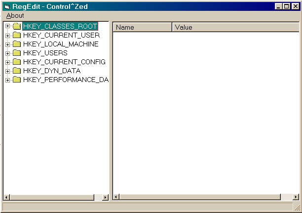



## Registry Viewer

### Description

A full functional registry viewer with treeView and ListView controls using API's
 
### More Info
 

             |
---                |---
**Submitted On**   |2000-06-19 04:30:34
**By**             |[Udi Azulay](https://github.com/Planet-Source-Code/PSCIndex/blob/master/ByAuthor/udi-azulay.md)
**Level**          |Intermediate
**User Rating**    |4.2 (25 globes from 6 users)
**Compatibility**  |VB 5\.0, VB 6\.0
**Category**       |[Registry](https://github.com/Planet-Source-Code/PSCIndex/blob/master/ByCategory/registry__1-36.md)
**World**          |[Visual Basic](https://github.com/Planet-Source-Code/PSCIndex/blob/master/ByWorld/visual-basic.md)
**Archive File**   |[CODE\_UPLOAD68956192000\.zip](https://github.com/Planet-Source-Code/udi-azulay-registry-viewer__1-9036/archive/master.zip)

### API Declarations

a few...

